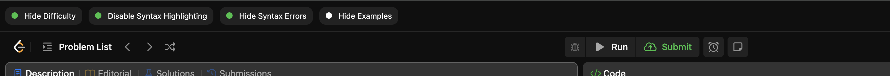
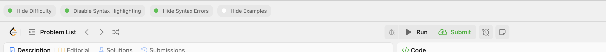

# Leetcode Helper

# Dev Loop

1. Run `npm run dev`
2. Do work
3. Open `chrome://extensions`
   1. If you haven't loaded the extension yet, press `Load Unpacked` and choose the dist directory
4. Refresh when you make changes

# Todo

- [ ] Improve re-rendering logic on explore page
- [ ] Add countdown timer pre-sets w/ alarm on code challenge page

# Permissions

- `storage`: Used to store which features are enable/disabled and restore their state on extension loading.

# Known Bugs

- Styles are reliant upon this PR https://github.com/drewrodrigues/postcss-namespace-2/pulls?q=is%3Apr+is%3Aclosed. This can be changed manually in node modules for now. Later I'll publish the package with a bumped version since it's no longer maintained.
